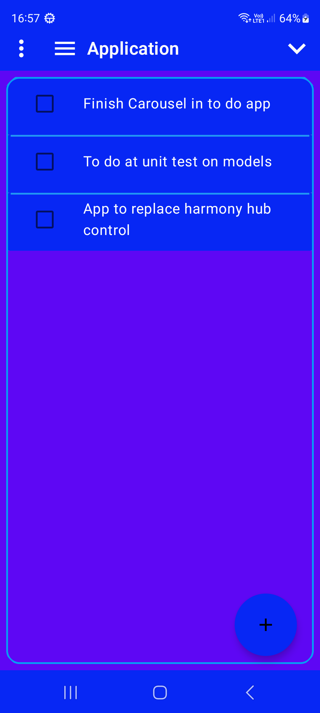
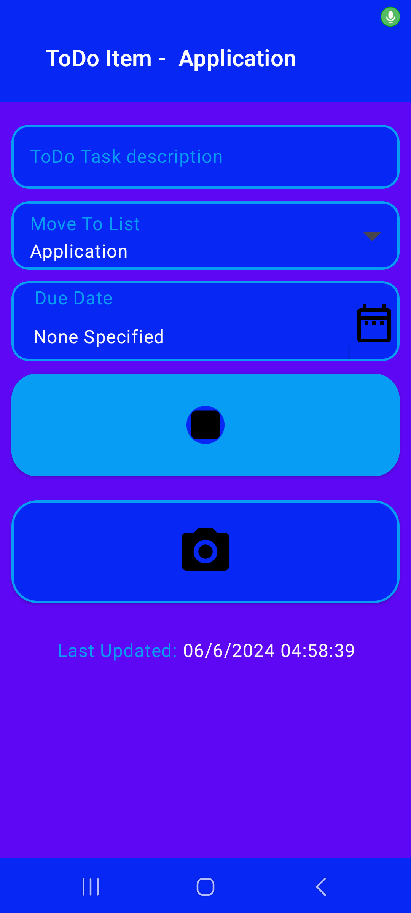
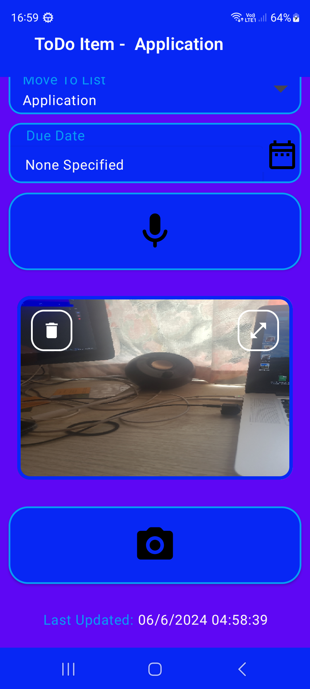

# ToDo Lists Application

This application allow the user to build and manage one or many ToDo list(s).

## Do List

 

Once an item has been completed the checkbox should be ticked and teh item will be moved to the
Finished list.

The user can switch between lists using the drop down list which is shown by clicking on the the
current list shown in the top bar of the application.

## ToDo Item

The task description can either be entered as text or recorded and translated to text using the
button with the microphone on it.

If you wish to move the current ToDo item to a different list, this can be achieved using the 'Move
To List' dropdown to select the new list.

You can add multiple images as supporting information for your current ToDo Item by pressing the
camera Button.

The screen grab shown has one image added, which an be deleted using the delete button overlayed on
the image. The other button shown as an overlay on the image will show
an enlarged version of the image using which the user may zoom in or out.

## Adding New Lists

To add a new ToDo list simply enter the list name in the input field and press the 'done' button on
the keyboard when completed.
Only lists with no tasks can be selected for deletion. To select a ToDo List just click on the
item (Which turns red) and then press the delete button that has appeared.

## Third party speech API

https://alphacephei.com/vosk/
